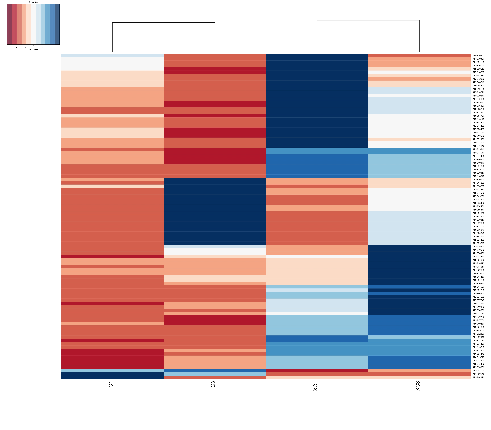

```{r setup, include=FALSE}
library(flexdashboard)
library(tidyverse)
library(highcharter)
library(gt)
library(htmltools)
library(viridis)
library(dplyr)
library(here)
```

```{r}
safi <- read_csv(here("SAFI_clean.csv"),na = "NULL")
safi <- safi %>% filter(!is.na(memb_assoc))
safi <- safi %>% filter(!is.na(affect_conflicts))
safi <- safi %>% filter(!is.na(items_owned))
```

# Data visualization

## Column {data-width="500"}

### Chart A

```{r}
custome_color <- viridis::mako(n = 3)
safi %>% group_by(village) %>% 
  summarise(no_membrs = sum(no_membrs)) %>% 
  arrange(desc(no_membrs)) %>%
  head() %>% 
  hchart('column', hcaes(x=village ,y=no_membrs , color = custome_color)) %>% 
  hc_add_theme(hc_theme_google()) %>% 
  hc_tooltip(pointFormat = '<b> Number of of mumbrs: </b> {point.y} <br>') %>% 
  
  hc_subtitle(text = " Number of members for each village",
              style= list(fontsize="25px")) %>% 
  hc_credits(enable = TRUE, text= "mona")
  
  
```

## Column {data-width="250"}

### Chart B

```{r}
custome_color <- viridis::cividis(n = 3)
safi %>% group_by(village) %>% 
  summarise(years_liv = mean(round(years_liv))) %>% 
  arrange(desc(years_liv)) %>%
  head() %>% 
  hchart('column', hcaes(x=village ,y=years_liv , color = custome_color)) %>% 
  hc_add_theme(hc_theme_google()) %>% 
  hc_tooltip(pointFormat = '<b> Number of of years liv: </b> {point.y} <br>') %>% 
  
  hc_subtitle(text = "Avrage number of years live",
              style= list(fontsize="25px")) %>% 
  hc_credits(enable = TRUE, text= "mona")
  
```

### Chart C

```{r}
custome_color <- viridis::inferno(n = 3)
safi %>% group_by(village) %>% 
  summarise(rooms = sum(rooms)) %>% 
  arrange(desc(rooms)) %>%
  head() %>% 
  hchart('column', hcaes(x=village ,y=rooms , color = custome_color)) %>% 
  hc_add_theme(hc_theme_google()) %>% 
  hc_tooltip(pointFormat = '<b> Number of of rooms: </b> {point.y} <br>') %>% 
  
  hc_subtitle(text = "The Total rooms in each village",
              style= list(fontsize="25px")) %>% 
  hc_credits(enable = TRUE, text= "mona")
  
```

## Column {data-width="500"}

### Chart D

```{r}
custome_color <- viridis::plasma(n = 3)
safi %>% group_by(village) %>% 
  summarise(liv_count = mean(liv_count)) %>% 
  arrange(desc(liv_count)) %>%
  head(15) %>% 
  hchart('column', hcaes(x=village ,y=liv_count , color = custome_color)) %>% 
  hc_add_theme(hc_theme_google()) %>% 
  hc_tooltip(pointFormat = '<b> Number of of liv_count: </b> {point.y} <br>') %>% 
  
  hc_subtitle(text = "Avrage number of pepole for each house",
              style= list(fontsize="25px")) %>% 
  hc_credits(enable = TRUE, text= "mona")       
  
```

# Heatmaps

## Column {data-width="500"}

### Pheatmap package

```{r}

```


## Column {data-width="500"}

### gplots package

```{r}

```


